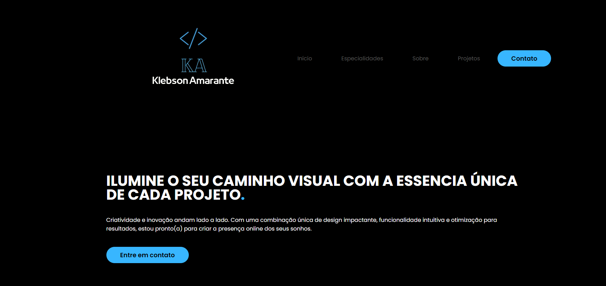

<h1 align="center">Portfólio</h1>

Criação de um portfólio para exibir algumas das minhas habilidades.

  <a href="#-tecnologias">Tecnologia</a>&nbsp;&nbsp;&nbsp;|&nbsp;&nbsp;&nbsp;
  <a href="#-projetos">Projetos</a>&nbsp;&nbsp;&nbsp;|&nbsp;&nbsp;&nbsp;
  <a href="#memo-licença">Licença</a>

  

 

## 🚀 Tecnologias 

- HTML, CSS e JavaScript
- Git e Github 

## 💻 Projeto

A ideia do projeto era desenvolver um portfólio usando HTML, CSS e JavaScript.

- [Acesse aqui o projeto online](https://https://klebsonamarantes.github.io/Portfolio-Klebson/)

## :memo: Licença

Esse projeto está sob a licença MIT.